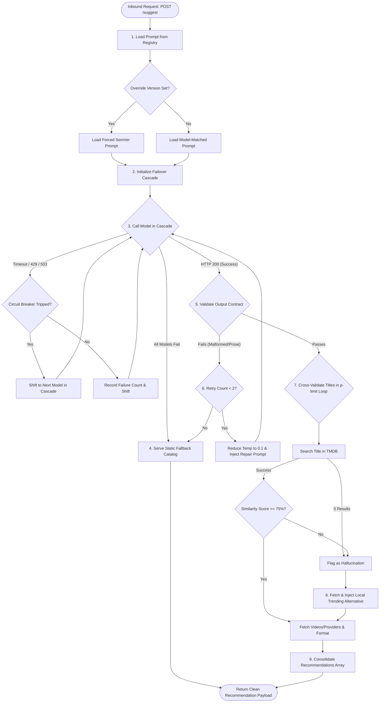

# Technical Design Document (design.md)
## EPIC-02: AI Orchestration & Prompt Reliability

This Technical Design Document details the software architectures, component pipelines, fallback cascade models, validation contracts, hallucination mitigation logic, and observability hooks required to satisfy **EPIC-02: AI Orchestration & Prompt Reliability**.

---

## 1. High-Level AI Orchestration Pipeline

The AI Orchestration layer manages incoming user requests through a secure validation, retry, failover, and verification pipeline:



---

## 2. Affected Backend Modules & Files

### A. Modified Modules
*   **[suggest.service.js](file:///d:/projetos/Cinematcha_V2/backend/src/services/suggest.service.js)**:
    *   Refactor the main entrypoint to orchestrate: loading system/user templates from prompt registries, coordinating the failover cascade loop, executing semantic retries, and cross-validating suggested titles.
*   **[suggest.controller.js](file:///d:/projetos/Cinematcha_V2/backend/src/controllers/suggest.controller.js)**:
    *   Expose telemetry metrics endpoint.
    *   Support request header parser to support dynamic version pins (e.g. `X-Cinematcha-Prompt-Version`).
*   **[server.js](file:///d:/projetos/Cinematcha_V2/backend/src/server.js)**:
    *   Mount the Prometheus `/metrics` route and register startup validators for prompt folder schemas.
*   **[package.json](file:///d:/projetos/Cinematcha_V2/backend/package.json)**:
    *   Add production packages: `prom-client` (observability telemetry).

### B. [NEW] Modules to Create
*   **[registry.js](file:///d:/projetos/Cinematcha_V2/backend/src/config/prompts/registry.js)**:
    *   File registry loader to read SemVer prompts, resolve locale overrides, and map default parameter matrices.
*   **[v1.0.0.js](file:///d:/projetos/Cinematcha_V2/backend/src/config/prompts/templates/v1.0.0.js)**:
    *   Declarative prompt module containing localized v1 recommendations templates, hyperparameter mappings, and contract configurations.
*   **[v1.1.0.js](file:///d:/projetos/Cinematcha_V2/backend/src/config/prompts/templates/v1.1.0.js)**:
    *   Next-gen prompt module featuring updated instruction structures and optimized JSON-formatting guidelines.
*   **[fallback_catalog.json](file:///d:/projetos/Cinematcha_V2/backend/src/config/fallback_catalog.json)**:
    *   Offline recommendation index structured by locale (`pt`/`en`) containing static TMDB-compatible movie metadata arrays to ensure 100% service uptime during complete LLM API failures.
*   **[failover.service.js](file:///d:/projetos/Cinematcha_V2/backend/src/services/failover.service.js)**:
    *   Model failover cascade manager, stateful circuit breaker registries, dynamic model connection routing, and fallback loader triggers.
*   **[ai-validation.service.js](file:///d:/projetos/Cinematcha_V2/backend/src/services/ai-validation.service.js)**:
    *   Structural contract parser, conversational filler scanners, and semantic repair prompt generators.
*   **[similarity.js](file:///d:/projetos/Cinematcha_V2/backend/src/utils/similarity.js)**:
    *   Pure mathematical Jaro-Winkler string distance matcher for title correlation checks.

---

## 3. Prompt Registry & Versioning Architecture

System prompt templates are abstracted into modular JS files within the registry structure, enabling version-controlled prompt lifecycles.

### A. Registry Configuration Module (`v1.0.0.js`)
```javascript
// backend/src/config/prompts/templates/v1.0.0.js
export default {
  version: '1.0.0',
  description: 'Initial CSV movie suggestions prompt for Gemini Flash models',
  modelConstraints: ['gemini-1.5-flash-latest'],
  parameters: {
    temperature: 0.7,
    topP: 0.9,
    maxOutputTokens: 500
  },
  locales: {
    en: {
      systemPrompt: "You are Cinematcha, an expert movie recommendation engine.",
      userPrompt: "Based on this mood or description: '{{prompt}}', suggest exactly 5 to 10 movie titles that match. Your response MUST be a simple comma-separated string containing ONLY the titles, like this: 'Movie A, Movie B, Movie C'. Do not write introductory prose, conversational explanations, or extra punctuation."
    },
    pt: {
      systemPrompt: "Você é o Cinematcha, um motor inteligente especialista em recomendação de filmes.",
      userPrompt: "Com base no seguinte clima ou descrição: '{{prompt}}', sugira exatamente de 5 a 10 títulos de filmes correspondentes. Sua resposta DEVE ser uma string simples separada por vírgula contendo APENAS os títulos, desta forma: 'Filme A, Filme B, Filme C'. Não escreva introduções, explicações conversacionais ou pontuações extras."
    }
  }
};
```

### B. Prompt Registry Loader (`registry.js`)
```javascript
// backend/src/config/prompts/registry.js
import fs from 'fs';
import path from 'path';
import logger from '../../utils/logger.js';
import promptV100 from './templates/v1.0.0.js';
import promptV110 from './templates/v1.1.0.js';

const registry = {
  '1.0.0': promptV100,
  '1.1.0': promptV110
};

export function getPrompt(version, locale, promptInput) {
  const selectedVersion = process.env.PROMPT_VERSION_OVERRIDE || version || '1.0.0';
  const promptConfig = registry[selectedVersion];

  if (!promptConfig) {
    throw new Error(`[PROMPT] Requested version '${selectedVersion}' not found in registry.`);
  }

  const localeConfig = promptConfig.locales[locale] || promptConfig.locales['en'];
  
  // Dynamic string replacement
  const compiledUserPrompt = localeConfig.userPrompt.replace('{{prompt}}', promptInput);

  logger.info(`[PROMPT] Dynamic registry load. Version: ${selectedVersion}, Locale: ${locale}`);

  return {
    systemPrompt: localeConfig.systemPrompt,
    userPrompt: compiledUserPrompt,
    parameters: promptConfig.parameters
  };
}
```

---

## 4. AI Failover & Model Cascade Strategy

To ensure high availability, incoming suggestion tasks execute inside a cascading model client configured with strict connection limits and circuit breakers.

### A. Model Cascade Array Configuration
```javascript
// backend/src/services/failover.service.js
export const MODEL_CASCADE = [
  { id: 'gemini-1.5-flash-latest', timeoutMs: 8000, costPer1kIn: 0.000075, costPer1kOut: 0.0003 },
  { id: 'gemini-1.5-pro', timeoutMs: 10000, costPer1kIn: 0.0035, costPer1kOut: 0.0105 },
  { id: 'gemini-2.0-flash-exp', timeoutMs: 8000, costPer1kIn: 0.00015, costPer1kOut: 0.0006 }
];
```

### B. Stateful Circuit Breaker Registry
```javascript
// Stateful tracker inside failover.service.js
const circuitBreakerRegistry = {
  // 'gemini-1.5-flash-latest': { consecutiveFailures: 0, trippedUntil: null }
};

const FAILURE_THRESHOLD = 3;
const COOLDOWN_DURATION_MS = 300000; // 5 Minutes

export function isModelHealthy(modelId) {
  const record = circuitBreakerRegistry[modelId];
  if (!record) return true;
  
  if (record.trippedUntil && record.trippedUntil > Date.now()) {
    return false; // Circuit is TRIPPED (Open)
  }
  
  if (record.trippedUntil && record.trippedUntil <= Date.now()) {
    // Cooldown expired; Reset circuit to HALF-OPEN state
    record.consecutiveFailures = 0;
    record.trippedUntil = null;
  }
  
  return true;
}

export function recordModelFailure(modelId) {
  if (!circuitBreakerRegistry[modelId]) {
    circuitBreakerRegistry[modelId] = { consecutiveFailures: 0, trippedUntil: null };
  }
  
  const record = circuitBreakerRegistry[modelId];
  record.consecutiveFailures += 1;
  
  if (record.consecutiveFailures >= FAILURE_THRESHOLD) {
    record.trippedUntil = Date.now() + COOLDOWN_DURATION_MS;
    logger.warn(`[FAILOVER] Circuit Breaker TRIPPED for model ${modelId} until ${new Date(record.trippedUntil).toISOString()}`);
  }
}
```

---

## 5. Semantic Retry Pipeline & Validation Contracts

If an LLM returns unstructured text instead of a clean, comma-separated title string, the system intercepts the parse exception and triggers a targeted retry.

### A. Response Validation Contract (`ai-validation.service.js`)
```javascript
// backend/src/services/ai-validation.service.js
export function validateResponseContract(rawContent) {
  if (!rawContent || typeof rawContent !== 'string') {
    throw new Error('Response is null or not a string.');
  }

  // Check for common conversational prose patterns
  const conversationalProseTriggers = [
    /^sure/i, /^here are/i, /^here is/i, /^certainly/i, 
    /^recomendo/i, /^claro/i, /^como solicitado/i, 
    /\bsocial\b/i, /\bhope you\b/i, /\bmy suggestions\b/i
  ];

  const trimmed = rawContent.trim();
  const hasProse = conversationalProseTriggers.some(trigger => trigger.test(trimmed));

  if (hasProse) {
    throw new Error('Response contains conversational prose filler.');
  }

  // Parse comma-separated titles
  const titles = trimmed.split(',')
    .map(t => t.replace(/^[0-9]+[\.\-\)\s]+/, '').trim()) // Strip numbering like "1.", "2 - "
    .filter(t => t.length > 0);

  if (titles.length < 5 || titles.length > 10) {
    throw new Error(`Response title count out of boundaries: ${titles.length} titles parsed.`);
  }

  return titles;
}
```

### B. Semantic Retry Controller Mechanics
When a parsing exception occurs, the suggest service lowers model temperature to enforce determinism and appends a repair instruction:

```javascript
// Fragment inside suggest.service.js
export async function executeAICallWithRetry(promptInput, locale) {
  let attempt = 0;
  let currentPromptConfig = getPrompt('1.0.0', locale, promptInput);
  
  while (attempt <= 2) {
    try {
      const response = await callActiveModelCascade(currentPromptConfig);
      const parsedTitles = validateResponseContract(response);
      return parsedTitles; // Success
    } catch (err) {
      attempt++;
      logger.error(`[AI_ORCH] Attempt ${attempt} failed validation contract: ${err.message}`);
      
      if (attempt === 1) {
        // Retry 1: Keep prompt, force absolute temperature zero for determinism
        currentPromptConfig.parameters.temperature = 0.0;
        logger.info('[AI_ORCH] Semantic Retry #1: Enforcing deterministic temp=0.0');
      } else if (attempt === 2) {
        // Retry 2: Append severe repair guidance notes
        currentPromptConfig.userPrompt += "\n[REPAIR NOTICE: Your previous output failed contract constraints. Return ONLY comma-separated movie names. DO NOT write descriptions, conversational headers, lists, or numbers.]";
        currentPromptConfig.parameters.temperature = 0.0;
        logger.info('[AI_ORCH] Semantic Retry #2: Appending instruction repair blocks');
      } else {
        throw err; // Max retries exhausted
      }
    }
  }
}
```

---

## 6. Hallucination Mitigation & TMDB Cross-Validation

To prevent fake movies from appearing, the mapping loop runs Jaro-Winkler similarity gates and triggers dynamic backfills on eviction.

### A. Jaro-Winkler Similarity Implementation (`similarity.js`)
A dependency-free Jaro-Winkler string similarity utility is created:
```javascript
// backend/src/utils/similarity.js
export function calculateJaroWinkler(s1, s2) {
  const clean1 = s1.toLowerCase().trim();
  const clean2 = s2.toLowerCase().trim();

  if (clean1 === clean2) return 1.0;

  const len1 = clean1.length;
  const len2 = clean2.length;
  const matchWindow = Math.floor(Math.max(len1, len2) / 2) - 1;

  const matches1 = new Array(len1).fill(false);
  const matches2 = new Array(len2).fill(false);

  let matches = 0;
  let transpositions = 0;

  for (let i = 0; i < len1; i++) {
    const start = Math.max(0, i - matchWindow);
    const end = Math.min(len2 - 1, i + matchWindow);

    for (let j = start; j <= end; j++) {
      if (!matches2[j] && clean1[i] === clean2[j]) {
        matches1[i] = true;
        matches2[j] = true;
        matches++;
        break;
      }
    }
  }

  if (matches === 0) return 0.0;

  let k = 0;
  for (let i = 0; i < len1; i++) {
    if (matches1[i]) {
      while (!matches2[k]) k++;
      if (clean1[i] !== clean2[k]) transpositions++;
      k++;
    }
  }

  const jaro = (matches / len1 + matches / len2 + (matches - transpositions / 2) / matches) / 3;
  
  // Winkler modification for common prefix
  let prefix = 0;
  const maxPrefix = Math.min(4, Math.min(len1, len2));
  for (let i = 0; i < maxPrefix; i++) {
    if (clean1[i] === clean2[i]) prefix++;
    else break;
  }

  return jaro + prefix * 0.1 * (1 - jaro);
}
```

### B. Hallucination Eviction & Backfill Loop
Inside `suggest.service.js`, if a title's TMDB search matches score < 75%, it is evicted and backfilled:
```javascript
// backend/src/services/suggest.service.js
import { calculateJaroWinkler } from '../utils/similarity.js';
import tmdbService from './tmdb.service.js';

export async function processVerifiedMovies(movieTitles, locale) {
  const verifiedList = [];
  
  for (const title of movieTitles) {
    try {
      const tmdbMovie = await tmdbService.searchMovie(title, locale);
      
      if (!tmdbMovie) {
        logger.warn(`[CROSSVAL] Evicted: "${title}" - TMDB returned 0 search matches.`);
        continue; // Hallucination evicted
      }

      const matchScore = calculateJaroWinkler(title, tmdbMovie.title);
      
      if (matchScore < 0.75) {
        logger.warn(`[CROSSVAL] Evicted: "${title}" - Sim score too low (${Math.round(matchScore*100)}%). Best match: "${tmdbMovie.title}"`);
        continue; // Similarity threshold failed; Evicted
      }

      verifiedList.push(tmdbMovie);
    } catch (err) {
      logger.error(`[CROSSVAL] Error verifying "${title}": ${err.message}`);
    }
  }

  // Backfill loop to maintain target count (e.g. 5)
  const targetCount = 5;
  if (verifiedList.length < targetCount) {
    const gap = targetCount - verifiedList.length;
    logger.info(`[BACKFILL] Validation gap detected. Need ${gap} movies. Fetching trends...`);
    
    const trendingMovies = await tmdbService.getTrendingMovies(locale);
    let backfillIndex = 0;
    
    while (verifiedList.length < targetCount && backfillIndex < trendingMovies.length) {
      const candidate = trendingMovies[backfillIndex];
      // Avoid duplicate movie entries
      if (!verifiedList.some(m => m.id === candidate.id)) {
        verifiedList.push(candidate);
        logger.info(`[BACKFILL] Injected: "${candidate.title}" into recommendation slot`);
      }
      backfillIndex++;
    }
  }

  return verifiedList.slice(0, targetCount);
}
```

---

## 7. Resilience, Socket Timeouts & HTTP Retries

To protect outgoing connections, the HTTP client calls (Google Gemini, TMDB) utilize specific timeouts and exponential backoffs:

1.  **Request Deadline / Connection Timeout**: Wrapped in standard API HTTP fetch controllers utilizing `AbortController` signals to enforce strict limits:
    *   **Google Gemini Flash**: 8,000ms
    *   **Google Gemini Pro**: 10,000ms
    *   **TMDB API REST**: 4,000ms
2.  **Rate Limit Retries (HTTP 429)**: Backoff equation applied:
    $$\text{Delay} = \text{Initial Delay} \times 2^{\text{retries}} + \text{Random Jitter (0-100ms)}$$

---

## 8. Observability & Telemetry

### A. Structured Logging Patterns
Standardized logs capture the AI pipeline lifecycle:
*   *Failover*: `logger.warn('[AI_ORCH] MODEL_FAILOVER - Active model failed. Swapping: gemini-1.5-flash-latest -> gemini-1.5-pro. Error: 429')`
*   *Retry*: `logger.info('[AI_ORCH] SEMANTIC_RETRY - Contract failed. Retry count: 1. Mode: Temp Zero')`
*   *Eviction*: `logger.warn('[AI_ORCH] HALLUCINATION_EVICTED - Match score 42% below threshold. Sug: "The Martian 2", Match: "The Martian"')`

### B. Prometheus Telemetry Schemas
*   `cinematcha_ai_tokens_total`: Incremental counter tracking consumed tokens.
*   `cinematcha_ai_cost_usd_total`: Evaluates actual monetary expenditure using active pricing tables.
*   `cinematcha_ai_failures_total`: Monitors model failures (labels: `model_id`, `http_status`).

---

## 9. Rollback & Feature Flags Strategy

1.  **Registry Version Rollback**: In case of prompt degradation, the prompt version can be reverted to a stable baseline (e.g., `1.0.0`) by setting the `.env` flag:
    `PROMPT_VERSION_OVERRIDE=1.0.0`
2.  **AI Engine Disabler**: If complete Google API outages occur, the fallback catalog can be forced, returning pre-compiled trending movie suggestions without triggering network requests:
    `FORCE_STATIC_FALLBACK=true`
