# Technical Design Document (design.md)
## EPIC-04: Infrastructure Hardening & Observability

This Technical Design Document details the system architectures, service pipelines, Winston logger configurations, Prometheus exporter integrations, cost calculation metrics, and Docker Compose configuration blocks required to satisfy **EPIC-04: Infrastructure Hardening & Observability**.

---

## 1. High-Level Observability & Telemetry Pipeline

The telemetry and observability architecture captures client-to-service flows and translates runtime operations into indexed structured logs and scrapeable metrics data:

```mermaid
flowchart TD
    Client([User Client]) -- "1. HTTP Request (with Correlation Headers)" --> Express[Express API Gateway]
    
    subgraph Express Backend Container
        Express --> CorrelationMid[2. Correlation ID Middleware]
        CorrelationMid --> HTTPLogMid[3. Winston HTTP Logger]
        
        subgraph Business Core
            HTTPLogMid --> SuggestSvc[Suggest Service]
            SuggestSvc --> CacheCheck{4. Check Redis Cache}
            
            CacheCheck -- Hit --> RecordMetricHit[Record Cache Hit Counter]
            CacheCheck -- Miss --> CallAI[5. Call Gemini API]
            
            CallAI --> TokenExtractor[6. Extract Token Quantities]
            TokenExtractor --> CostCalc[7. Calculate Cost in USD]
            CostCalc --> RecordTokensCost[8. Record Counter Metrics & Logs]
        end
        
        Express -- "GET /metrics" --> PromExporter[9. prom-client Metrics Exporter]
    end
    
    subgraph Persistent Storage
        HTTPLogMid -- "File Streaming" --> LogRotator[10. Daily File Rotation]
        LogRotator --> CombinedLog[(combined.log)]
        LogRotator --> ErrorLog[(error.log)]
    end
    
    subgraph Observability Container Stack
        Prometheus[Prometheus Service] -- "11. Scrapes /metrics (every 15s)" --> PromExporter
        Prometheus --> PromTSDB[(Prometheus TSDB Volume)]
        
        Grafana[Grafana Dashboard] -- "12. Reads Time Series" --> Prometheus
        UserAdmin([SRE / Ops Admin]) -- "13. Port 3000 Web UI" --> Grafana
    end
    
    style Express fill:#333,stroke:#666,stroke-width:2px
    style CombinedLog fill:#1A5CBA,stroke:#fff,stroke-width:1px
    style ErrorLog fill:#A80000,stroke:#fff,stroke-width:1px
    style Prometheus fill:#E6522C,stroke:#B23414,stroke-width:2px
    style Grafana fill:#FADE06,stroke:#D5AA00,stroke-width:2px
```



---

## 2. Affected Backend Modules & Files

### A. Modified Modules
*   **[server.js](file:///d:/projetos/Cinematcha_V2/backend/src/server.js)**:
    *   Initialize and configure correlation ID handlers and mount Express HTTP logging middleware.
    *   Register and expose the dynamic `/metrics` endpoint, protected by basic network checking.
    *   Setup startup check hooks validating logging volume write access.
*   **[suggest.service.js](file:///d:/projetos/Cinematcha_V2/backend/src/services/suggest.service.js)**:
    *   Inject Winston logging entries tracking suggestions stages (registry prompt parsing, TMDB mapping).
    *   Integrate token count checks and hook transaction costs through the Cost Calculator utility.
*   **[tmdb.service.js](file:///d:/projetos/Cinematcha_V2/backend/src/services/tmdb.service.js)**:
    *   Integrate cache tracking hooks (`cinematcha_cache_hits_total`) for movie detail and provider scans.
*   **[package.json](file:///d:/projetos/Cinematcha_V2/backend/package.json)**:
    *   Add production packages: `winston` (core logging), `winston-daily-rotate-file` (rotation), and `prom-client` (telemetry).
*   **[docker-compose.yml](file:///d:/projetos/Cinematcha_V2/docker-compose.yml)**:
    *   Mount local volume directory for persistent application logs.
    *   Add isolated `prometheus` and `grafana` services mapped to the core `app-network`.

### B. [NEW] Modules to Create
*   **[logger.js](file:///d:/projetos/Cinematcha_V2/backend/src/utils/logger.js)**:
    *   Winston client configuring console layouts, JSON mappings, production log rotation, and dynamic bypass flags.
*   **[logging.middleware.js](file:///d:/projetos/Cinematcha_V2/backend/src/middleware/logging.middleware.js)**:
    *   Middleware extracting incoming transaction trace IDs (`X-Correlation-ID`) and intercepting outgoing HTTP request parameters to log response latency.
*   **[metrics.js](file:///d:/projetos/Cinematcha_V2/backend/src/config/metrics.js)**:
    *   Registry configuration for custom Prometheus metrics (counters, histograms) and default NodeJS system trackers.
*   **[cost-calculator.js](file:///d:/projetos/Cinematcha_V2/backend/src/utils/cost-calculator.js)**:
    *   LLM pricing configuration catalog and dynamic transactional cost aggregator.
*   **[prometheus.yml](file:///d:/projetos/Cinematcha_V2/infrastructure/prometheus/prometheus.yml)**:
    *   Declarative scrapers, scrape configurations, targets, and internal gateway boundaries.
*   **[datasource.yml](file:///d:/projetos/Cinematcha_V2/infrastructure/grafana/provisioning/datasources/datasource.yml)**:
    *   Grafana data source configuration automatically bootstrapping connection keys to Prometheus.
*   **[dashboards.yml](file:///d:/projetos/Cinematcha_V2/infrastructure/grafana/provisioning/dashboards/dashboards.yml)**:
    *   Grafana provisioning dashboard manager pointing to declarative dashboards JSON storage files.
*   **[cinematcha_dashboard.json](file:///d:/projetos/Cinematcha_V2/infrastructure/grafana/provisioning/dashboards/cinematcha_dashboard.json)**:
    *   Visual layout dashboard schema displaying latency distributions, caching, errors, tokens, and billing charts.

---

## 3. Winston Structured Logging Architecture (`logger.js`)

A production-grade Winston configuration provides environment isolation, correlation mappings, structured JSON formats, and gzip-enabled file-writes.

```javascript
// backend/src/utils/logger.js
import winston from 'winston';
import 'winston-daily-rotate-file';
import path from 'path';

const LOG_DIR = process.env.LOG_DIR || '/var/log/cinematcha';
const isProduction = process.env.NODE_ENV === 'production';
const telemetryDisabled = process.env.DISABLE_TELEMETRY === 'true';
const forceMinimal = process.env.FORCE_MINIMAL_LOGGING === 'true';

// Custom format to support Correlation IDs and rich metadata mapping
const standardFormat = winston.format.combine(
  winston.format.timestamp({ format: 'YYYY-MM-DDTHH:mm:ss.SSSZ' }),
  winston.format.errors({ stack: true }),
  winston.format.metadata({ fillWith: ['timestamp', 'context', 'traceId'] }),
  winston.format.json()
);

const devFormat = winston.format.combine(
  winston.format.colorize(),
  winston.format.timestamp({ format: 'HH:mm:ss' }),
  winston.format.printf(({ level, message, timestamp, context, traceId, stack }) => {
    const ctx = context ? ` [\x1b[36m${context}\x1b[0m]` : '';
    const trace = traceId ? ` [trace:\x1b[33m${traceId}\x1b[0m]` : '';
    const errStack = stack ? `\n${stack}` : '';
    return `[${timestamp}] ${level}:${ctx}${trace} ${message}${errStack}`;
  })
);

// Determine active logs severity limit
let activeLogLevel = 'info';
if (forceMinimal) {
  activeLogLevel = 'error';
} else if (process.env.LOG_LEVEL) {
  activeLogLevel = process.env.LOG_LEVEL;
} else if (!isProduction) {
  activeLogLevel = 'debug';
}

const transports = [];

// Console streaming (Standard Output)
transports.push(
  new winston.transports.Console({
    level: activeLogLevel,
    format: isProduction ? standardFormat : devFormat
  })
);

// File streaming (Production only, skip if forced minimal)
if (isProduction && !forceMinimal) {
  // Combined log rotation
  transports.push(
    new winston.transports.DailyRotateFile({
      filename: path.join(LOG_DIR, 'combined-%DATE%.log'),
      datePattern: 'YYYY-MM-DD',
      zippedArchive: true,
      maxSize: '10m',
      maxFiles: '14d',
      level: 'info',
      format: standardFormat
    })
  );

  // Dedicated error log rotation
  transports.push(
    new winston.transports.DailyRotateFile({
      filename: path.join(LOG_DIR, 'error-%DATE%.log'),
      datePattern: 'YYYY-MM-DD',
      zippedArchive: true,
      maxSize: '10m',
      maxFiles: '14d',
      level: 'error',
      format: standardFormat
    })
  );
}

const logger = winston.createLogger({
  level: activeLogLevel,
  exitOnError: false,
  transports
});

export default logger;
```

---

## 4. Correlation Tracking & Express HTTP Middleware

The API gateway manages request pipelines through correlation injection and response latencies interceptors:

```javascript
// backend/src/middleware/logging.middleware.js
import crypto from 'crypto';
import logger from '../utils/logger.js';
import { httpRequestDuration } from '../config/metrics.js';

// Middleware to capture X-Correlation-ID or inject a fresh UUID v4 trace
export function correlationIdMiddleware(req, res, next) {
  const correlationHeader = req.get('X-Correlation-ID');
  const traceId = correlationHeader || crypto.randomUUID();
  
  // Attach correlation ID to request context for subsequent processing steps
  req.traceId = traceId;
  res.set('X-Correlation-ID', traceId);
  next();
}

// Middleware to capture Express endpoint transaction metrics and JSON log outputs
export function httpLoggingMiddleware(req, res, next) {
  const startTime = process.hrtime();
  
  res.on('finish', () => {
    const diff = process.hrtime(startTime);
    const durationSeconds = diff[0] + diff[1] / 1e9;
    const statusCode = res.statusCode;
    
    // 1. Record transaction latency duration in Prometheus Histogram
    httpRequestDuration
      .labels(req.method, req.route ? req.route.path : req.path, statusCode)
      .observe(durationSeconds);

    // 2. Output structured JSON transaction log via Winston
    logger.info({
      message: `HTTP ${req.method} ${req.originalUrl} finished with status ${statusCode} in ${Math.round(durationSeconds * 1000)}ms`,
      context: 'API_GATEWAY',
      traceId: req.traceId,
      metadata: {
        method: req.method,
        url: req.originalUrl,
        statusCode,
        durationMs: Math.round(durationSeconds * 1000),
        userAgent: req.get('User-Agent'),
        ip: req.ip
      }
    });
  });
  
  next();
}
```

---

## 5. Prometheus Telemetry Registry (`metrics.js`)

Custom counters and default NodeJS resource monitors are registered into a centralized registry:

```javascript
// backend/src/config/metrics.js
import client from 'prom-client';

const telemetryDisabled = process.env.DISABLE_TELEMETRY === 'true';

// Create a custom registry instances
const register = new client.Registry();

// Initialize default system metrics if telemetry is not bypassed
if (!telemetryDisabled) {
  client.collectDefaultMetrics({ register, prefix: 'cinematcha_' });
}

// 1. Custom HTTP Requests Counter
export const httpRequestsTotal = new client.Counter({
  name: 'cinematcha_http_requests_total',
  help: 'Total number of HTTP requests processed by Cinematcha Gateway',
  labelNames: ['method', 'route', 'status_code'],
  registers: telemetryDisabled ? [] : [register]
});

// 2. Custom HTTP Duration Histogram
export const httpRequestDuration = new client.Histogram({
  name: 'cinematcha_http_request_duration_seconds',
  help: 'Duration of HTTP requests in seconds',
  labelNames: ['method', 'route', 'status_code'],
  buckets: [0.05, 0.1, 0.25, 0.5, 1.0, 2.5, 5.0, 10.0],
  registers: telemetryDisabled ? [] : [register]
});

// 3. Redis Cache Hit Rate Tracker
export const cacheHitsTotal = new client.Counter({
  name: 'cinematcha_cache_hits_total',
  help: 'Total number of cache checks against Redis',
  labelNames: ['cache_type', 'hit'],
  registers: telemetryDisabled ? [] : [register]
});

// 4. Gemini Token Consumption Tracker
export const aiTokensTotal = new client.Counter({
  name: 'cinematcha_ai_tokens_total',
  help: 'Total tokens processed by Gemini models',
  labelNames: ['model_id', 'type'], // type: 'input' or 'output'
  registers: telemetryDisabled ? [] : [register]
});

// 5. LLM Accumulated Cost Tracker
export const aiCostUsdTotal = new client.Counter({
  name: 'cinematcha_ai_cost_usd_total',
  help: 'Cumulative monetary cost in USD of Gemini transactions',
  labelNames: ['model_id', 'context'], // context: 'suggest' or 'fallback'
  registers: telemetryDisabled ? [] : [register]
});

// Route handler exposing /metrics endpoint
export async function metricsEndpointHandler(req, res) {
  if (telemetryDisabled) {
    res.status(503).send('Telemetry Disabled via environment configurations.');
    return;
  }
  
  try {
    res.set('Content-Type', register.contentType);
    res.send(await register.metrics());
  } catch (err) {
    res.status(500).send(err.message);
  }
}
```

---

## 6. Token Usage & Cost Observability (`cost-calculator.js`)

A cost engine aggregates prompt token arrays and evaluates transaction charges based on in-memory pricing catalog indexes:

```javascript
// backend/src/utils/cost-calculator.js
import logger from './logger.js';
import { aiTokensTotal, aiCostUsdTotal } from '../config/metrics.js';

// In-Memory Model Token Pricing Sheets (per 1,000 tokens)
const PRICING_CATALOG = {
  'gemini-1.5-flash-latest': {
    input: 0.000075 / 1000,
    output: 0.0003 / 1000
  },
  'gemini-1.5-pro': {
    input: 0.0035 / 1000,
    output: 0.0105 / 1000
  },
  'gemini-2.0-flash-exp': {
    input: 0.00015 / 1000,
    output: 0.0006 / 1000
  }
};

export function trackTransactionCosts(modelId, inputTokenCount, outputTokenCount, traceId, context = 'suggest') {
  const modelRates = PRICING_CATALOG[modelId] || PRICING_CATALOG['gemini-1.5-flash-latest'];
  
  // Calculate dynamic transaction cost
  const inputCost = inputTokenCount * modelRates.input;
  const outputCost = outputTokenCount * modelRates.output;
  const totalCost = inputCost + outputCost;

  // 1. Record Prometheus counters
  aiTokensTotal.labels(modelId, 'input').inc(inputTokenCount);
  aiTokensTotal.labels(modelId, 'output').inc(outputTokenCount);
  aiCostUsdTotal.labels(modelId, context).inc(totalCost);

  // 2. Emit structured log tracking costs
  logger.info({
    message: `[AI_COST] Transaction completed. Model: ${modelId}, Tokens: [In:${inputTokenCount} | Out:${outputTokenCount}], Cost: $${totalCost.toFixed(6)}`,
    context: 'AI_ORCHESTRATION',
    traceId,
    metadata: {
      modelId,
      inputTokenCount,
      outputTokenCount,
      totalCost,
      context
    }
  });

  return totalCost;
}
```

---

## 7. Prometheus Scraping & Target Configuration (`prometheus.yml`)

The Prometheus target rules set strict 15-second scraping intervals to monitor the Docker API container:

```yaml
# infrastructure/prometheus/prometheus.yml
global:
  scrape_interval: 15s
  evaluation_interval: 15s
  scrape_timeout: 10s

scrape_configs:
  - job_name: 'cinematcha-backend'
    metrics_path: '/metrics'
    static_configs:
      - targets: ['backend:3001'] # Resolves dynamically via Docker app-network DNS
```

---

## 8. Docker Compose Observability Topology

We update `docker-compose.yml` to incorporate Prometheus and Grafana containers, private network bridge links, host mapping, and persistent named disk volumes:

```yaml
# Updated sections of docker-compose.yml
version: '3.8'

services:
  frontend:
    build: ./frontend
    container_name: cinematcha-frontend
    ports:
      - "5173:5173"
    networks:
      - app-network
    depends_on:
      - backend

  backend:
    build: ./backend
    container_name: cinematcha-backend
    ports:
      - "3001:3001"
    environment:
      - NODE_ENV=production
      - PORT=3001
      - LOG_DIR=/var/log/cinematcha
      - LOG_LEVEL=info
      - REDIS_URL=redis://redis:6379
    volumes:
      - app-logs:/var/log/cinematcha
    networks:
      - app-network
    depends_on:
      - redis

  redis:
    image: redis:7-alpine
    container_name: cinematcha-redis
    networks:
      - app-network

  # NEW Observability Services
  prometheus:
    image: prom/prometheus:v2.45.0
    container_name: cinematcha-prometheus
    volumes:
      - ./infrastructure/prometheus/prometheus.yml:/etc/prometheus/prometheus.yml:ro
      - prometheus-data:/prometheus
    command:
      - '--config.file=/etc/prometheus/prometheus.yml'
      - '--storage.tsdb.path=/prometheus'
      - '--storage.tsdb.retention.time=15d'
    networks:
      - app-network
    restart: unless-stopped

  grafana:
    image: grafana/grafana:10.0.0
    container_name: cinematcha-grafana
    ports:
      - "3000:3000"
    environment:
      - GF_SECURITY_ADMIN_USER=${GRAFANA_ADMIN_USER:-admin}
      - GF_SECURITY_ADMIN_PASSWORD=${GRAFANA_ADMIN_PASSWORD:-cinematcha_secure_2026}
      - GF_USERS_ALLOW_SIGN_UP=false
    volumes:
      - grafana-data:/var/lib/grafana
      - ./infrastructure/grafana/provisioning:/etc/grafana/provisioning:ro
    networks:
      - app-network
    depends_on:
      - prometheus
    restart: unless-stopped

networks:
  app-network:
    driver: bridge

volumes:
  app-logs:
  prometheus-data:
  grafana-data:
```

---

## 9. Grafana Dashboards-as-Code Provisioning Layout

We declare auto-provisioning bindings to map time-series data streams dynamically during container initialization:

### A. Grafana Datasource Provider (`datasource.yml`)
```yaml
# infrastructure/grafana/provisioning/datasources/datasource.yml
apiVersion: 1

datasources:
  - name: Prometheus
    type: prometheus
    access: proxy
    url: http://prometheus:9090 # Resolves via Docker bridge DNS
    isDefault: true
    editable: false
```

### B. Grafana Dashboard Registry Configuration (`dashboards.yml`)
```yaml
# infrastructure/grafana/provisioning/dashboards/dashboards.yml
apiVersion: 1

providers:
  - name: 'Cinematcha Provisioned Dashboards'
    orgId: 1
    folder: 'Cinematcha'
    type: file
    disableDeletion: true
    editable: true
    options:
      path: /etc/grafana/provisioning/dashboards
```

### C. Unified Observability Dashboard Layout Model (`cinematcha_dashboard.json`)
The custom dashboard model aggregates PromQL queries to display visual dashboard charts:
*   **Active Throughput (Requests/sec)**:
    `rate(cinematcha_http_requests_total[1m])`
*   **Average API Gateway Latency**:
    `rate(cinematcha_http_request_duration_seconds_sum[5m]) / rate(cinematcha_http_request_duration_seconds_count[5m])`
*   **Error Rate Ratio (5xx Responses)**:
    `sum(rate(cinematcha_http_requests_total{status_code=~"5.."}[5m])) / sum(rate(cinematcha_http_requests_total[5m])) * 100`
*   **Redis Cache Success Hit-Ratio**:
    `sum(rate(cinematcha_cache_hits_total{hit="true"}[5m])) / sum(rate(cinematcha_cache_hits_total[5m])) * 100`
*   **Cumulative AI Token Spending in USD**:
    `sum(cinematcha_ai_cost_usd_total)`
*   **Active Prompt Tokens Count Breakdown (Input vs Output)**:
    `sum by (type) (rate(cinematcha_ai_tokens_total[5m]))`
*   **System Failovers & Outages Swaps**:
    `rate(cinematcha_ai_failover_total[5m])`

---

## 10. Rollback & Feature Flags Design

1.  **Telemetry Registry Guard bypass (`DISABLE_TELEMETRY=true`)**:
    When active, the metrics configuration imports empty arrays `registers: []` to prevent `prom-client` from registering telemetry hooks, and `metricsEndpointHandler` instantly rejects calls. This ensures any memory leaks or exceptions on metrics code bypass Express routing pipelines entirely.
2.  **Hard Logging Fail-Safe bypass (`FORCE_MINIMAL_LOGGING=true`)**:
    If host disks trigger alarms (below 10% space), this flag is flipped. This resets Winston's active logging level to `error` and halts writing to file streams. Standard out (`stdout`) receives standard error lines only, keeping the node runtime operational and preserving disk sectors.
