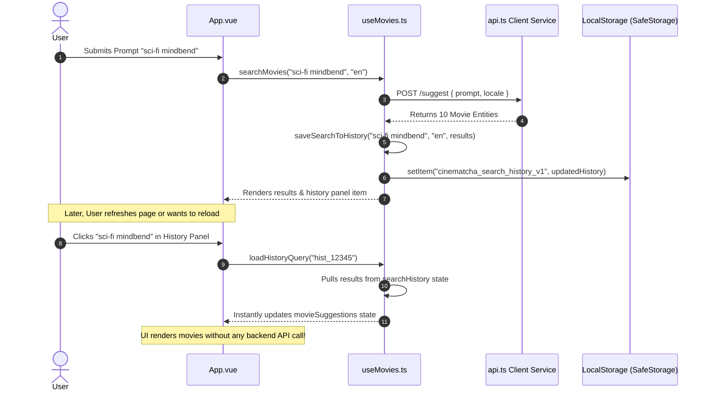
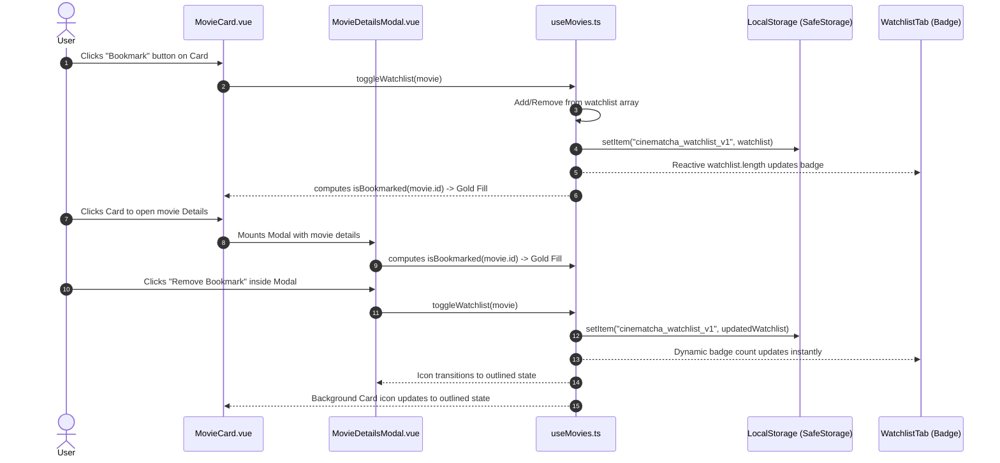
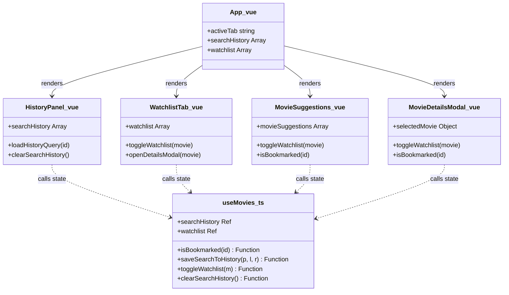

# Technical Design Document (design.md)
## EPIC-05: User Personalization & Experience

This Technical Design Document details the frontend SPA architecture, Vue 3 Composable extensions, LocalStorage schemas, safe serialization wrappers, component-level impacts, and UX interaction flows required to satisfy **EPIC-05: User Personalization & Experience**.

---

## 1. High-Level Personalization & Persistence Architecture

The personalization architecture integrates state management within the Vue 3 Composition API and persists clean data models locally within the browser context. The client SPA manages all persistence operations asynchronously and safely, guaranteeing that no local storage faults or permissions barriers can compromise core system operations.

```mermaid
flowchart TD
    subgraph Browser Client (Vue 3 SPA)
        App[App.vue Layout] <--> TabsSvc[useTabs.ts Composable]
        App <--> MoviesSvc[useMovies.ts Composable]
        
        subgraph useMovies.ts State Core
            HistoryState[searchHistory Array State]
            WatchlistState[watchlist Array State]
            ActiveSuggestions[movieSuggestions Active State]
        end
        
        subgraph Storage Engine
            SafeSerializer[safe-storage.ts Utility]
        end
        
        MoviesSvc <--> SafeSerializer
        
        subgraph Components Layer
            SuggestionsView[MovieSuggestions.vue]
            DetailsModal[MovieDetailsModal.vue]
            WatchlistView[WatchlistTab.vue Component]
            HistoryPanel[HistoryPanel.vue Component]
        end
        
        SuggestionsView <--> MoviesSvc
        DetailsModal <--> MoviesSvc
        WatchlistView <--> MoviesSvc
        HistoryPanel <--> MoviesSvc
    end
    
    subgraph Browser Local Storage
        LS_History[(cinematcha_search_history_v1 Namespace)]
        LS_Watchlist[(cinematcha_watchlist_v1 Namespace)]
    end
    
    subgraph Backend API Gateway
        ExpressRoute[GET /suggest/tmdb/providers/:movieId]
    end
    
    SafeSerializer -- "Write / Read JSON" --> LS_History
    SafeSerializer -- "Write / Read JSON" --> LS_Watchlist
    WatchlistView -- "On-Demand Fetch Providers" --> ExpressRoute
    
    style App fill:#41B883,stroke:#35495E,stroke-width:2px
    style MoviesSvc fill:#41B883,stroke:#35495E,stroke-width:1px
    style LS_History fill:#1A5CBA,stroke:#fff,stroke-width:1px
    style LS_Watchlist fill:#1A5CBA,stroke:#fff,stroke-width:1px
```

---

## 2. Affected Frontend Modules & Files

### A. Modified Modules
*   **[useMovies.ts](file:///d:/projetos/Cinematcha_V2/frontend/src/composables/useMovies.ts)**:
    *   Extend state with `searchHistory` and `watchlist` reactive properties.
    *   Inject logic inside recommendation processing to save successful queries to history.
    *   Implement actions `toggleWatchlist(movie)`, `clearSearchHistory()`, `loadHistoryQuery(historyId)`, and helper `isBookmarked(movieId)`.
    *   Integrate safe storage read/write calls on initialization and mutation.
*   **[useTabs.ts](file:///d:/projetos/Cinematcha_V2/frontend/src/composables/useTabs.ts)**:
    *   Register `'watchlist'` inside the supported navigation tabs array registry.
*   **[App.vue](file:///d:/projetos/Cinematcha_V2/frontend/src/App.vue)**:
    *   Add navigation tab trigger for "My Watchlist", featuring a dynamic badge indicating active items count.
    *   Mount the "Previous Searches" panel below the central movie prompt search bar.
    *   Include rendering coordinator for the new `WatchlistTab.vue` view.
*   **[MovieSuggestions.vue](file:///d:/projetos/Cinematcha_V2/frontend/src/components/MovieSuggestions.vue)**:
    *   Integrate the Bookmark icon button on suggestion list card elements, connecting click triggers to `toggleWatchlist`.
*   **[MovieDetailsModal.vue](file:///d:/projetos/Cinematcha_V2/frontend/src/components/MovieDetailsModal.vue)**:
    *   Add Bookmark action button inside primary layout, mirroring bookmark states instantly.

### B. [NEW] Modules to Create
*   **[safe-storage.ts](file:///d:/projetos/Cinematcha_V2/frontend/src/utils/safe-storage.ts)**:
    *   Encapsulated persistence helper utility containing `try-catch` boundaries, QuotaExceeded checks, JSON standard formatting, and runtime telemetry.
*   **[WatchlistTab.vue](file:///d:/projetos/Cinematcha_V2/frontend/src/components/WatchlistTab.vue)**:
    *   Dedicated view rendering active watchlist items, empty state graphics, and custom CTAs.
*   **[HistoryPanel.vue](file:///d:/projetos/Cinematcha_V2/frontend/src/components/HistoryPanel.vue)**:
    *   Responsive component rendering the list of saved previous searches with query pills, instant reload binds, and clean-all buttons.

---

## 3. LocalStorage JSON Schema & Payload Footprint

To ensure maximum performance and respect browser storage limits, data models saved to `LocalStorage` strictly strip secondary runtime properties.

### A. Search History Schema (`cinematcha_search_history_v1`)
Optimized JSON structure mapping prompt inputs to parsed results (limited to 10 entries):
```json
[
  {
    "id": "hist_1715897950000",
    "prompt": "mind-bending sci-fi movies like Interstellar",
    "locale": "en",
    "timestamp": "2026-05-16T22:19:10Z",
    "results": [
      {
        "id": 157336,
        "title": "Interstellar",
        "poster": "/gEU2QvJWzIF7efg2tTMt7uJ2Qbc.jpg",
        "overview": "The adventures of a group of explorers who make use of a newly discovered wormhole...",
        "year": 2014,
        "rating": 8.4,
        "trailer": "https://www.youtube.com/watch?v=zSWdZAZeMGl"
      }
    ]
  }
]
```

### B. Watchlist Schema (`cinematcha_watchlist_v1`)
Clean, flat array of movies (capped at 100 entries):
```json
[
  {
    "id": 157336,
    "title": "Interstellar",
    "poster": "/gEU2QvJWzIF7efg2tTMt7uJ2Qbc.jpg",
    "overview": "The adventures of a group of explorers...",
    "year": 2014,
    "rating": 8.4,
    "trailer": "https://www.youtube.com/watch?v=zSWdZAZeMGl"
  }
]
```

---

## 4. Safe Browser Storage Engine (`safe-storage.ts`)

A defensive serialization wrapper guarantees resilience against third-party blocking policies, cookie restrictions, and storage limit exhaustion.

```typescript
// frontend/src/utils/safe-storage.ts

const disablePersistence = import.meta.env.VITE_DISABLE_PERSISTENCE === 'true';

export const SafeStorage = {
  /**
   * Safe setItem wrapper wrapping localStorage writes in secure boundary blocks
   */
  setItem(key: string, value: any): boolean {
    if (disablePersistence) return false;
    
    try {
      const serializedValue = JSON.stringify(value);
      window.localStorage.setItem(key, serializedValue);
      return true;
    } catch (error) {
      console.warn(`[SafeStorage] Write failed for key "${key}":`, error);
      
      // Explicitly check for quota boundaries
      if (
        error instanceof DOMException &&
        (error.name === 'QuotaExceededError' ||
          error.name === 'NS_ERROR_DOM_QUOTA_REACHED' ||
          error.code === 22)
      ) {
        console.error('[SafeStorage] Browser LocalStorage is completely full!');
      }
      return false;
    }
  },

  /**
   * Safe getItem wrapper ensuring parsing faults fall back gracefully to null
   */
  getItem<T>(key: string): T | null {
    if (disablePersistence) return null;
    
    try {
      const serializedValue = window.localStorage.getItem(key);
      if (!serializedValue) return null;
      return JSON.parse(serializedValue) as T;
    } catch (error) {
      console.warn(`[SafeStorage] Read failed for key "${key}":`, error);
      return null;
    }
  },

  /**
   * Safe removeItem wrapper
   */
  removeItem(key: string): boolean {
    if (disablePersistence) return false;
    
    try {
      window.localStorage.removeItem(key);
      return true;
    } catch (error) {
      console.warn(`[SafeStorage] Remove failed for key "${key}":`, error);
      return false;
    }
  }
};
```

---

## 5. Frontend Composable Extensions (`useMovies.ts`)

We extend `useMovies.ts` to manage search history and watchlists alongside dynamic suggestion pipelines:

```typescript
// Extended sections of frontend/src/composables/useMovies.ts
import { ref, computed, watch, onMounted } from 'vue';
import { SafeStorage } from '../utils/safe-storage';

// Interfaces mapping optimized schemas
export interface CompactMovie {
  id: number;
  title: string;
  poster: string;
  overview: string;
  year: number;
  rating: number;
  trailer: string;
}

export interface HistoryItem {
  id: string;
  prompt: string;
  locale: string;
  timestamp: string;
  results: CompactMovie[];
}

const HISTORY_KEY = 'cinematcha_search_history_v1';
const WATCHLIST_KEY = 'cinematcha_watchlist_v1';
const MAX_HISTORY = 10;
const MAX_WATCHLIST = 100;

export function useMovies() {
  // Established core state references
  const movieSuggestions = ref<CompactMovie[]>([]);
  const trendingMovies = ref<any[]>([]);
  const popularMovies = ref<any[]>([]);
  const selectedMovie = ref<any | null>(null);
  const loading = ref(false);

  // NEW Personalization Reactive States
  const searchHistory = ref<HistoryItem[]>([]);
  const watchlist = ref<CompactMovie[]>([]);
  const storageLimitWarning = ref(false);

  // Initialize data on component mount
  onMounted(() => {
    searchHistory.value = SafeStorage.getItem<HistoryItem[]>(HISTORY_KEY) || [];
    watchlist.value = SafeStorage.getItem<CompactMovie[]>(WATCHLIST_KEY) || [];
  });

  // Dynamic bookmark helper
  const isBookmarked = (movieId: number) => {
    return watchlist.value.some(m => m.id === movieId);
  };

  /**
   * Capture and save a successful search query to searchHistory
   */
  const saveSearchToHistory = (prompt: string, locale: string, results: CompactMovie[]) => {
    if (!prompt.trim() || results.length === 0) return;

    // Remove existing duplicates of the same prompt to raise it to the top
    const filteredHistory = searchHistory.value.filter(
      item => item.prompt.toLowerCase() !== prompt.toLowerCase()
    );

    const newItem: HistoryItem = {
      id: `hist_${Date.now()}`,
      prompt,
      locale,
      timestamp: new Date().toISOString(),
      results
    };

    const updated = [newItem, ...filteredHistory].slice(0, MAX_HISTORY);
    searchHistory.value = updated;
    SafeStorage.setItem(HISTORY_KEY, updated);
  };

  /**
   * Instantly reloads a previous search query and results without making API requests
   */
  const loadHistoryQuery = (historyId: string) => {
    const matchedItem = searchHistory.value.find(item => item.id === historyId);
    if (matchedItem) {
      movieSuggestions.value = matchedItem.results;
      // Scroll smoothly to results layout
      document.getElementById('suggestions-anchor')?.scrollIntoView({ behavior: 'smooth' });
    }
  };

  /**
   * Toggles bookmark state for a movie card, managing size cap checks
   */
  const toggleWatchlist = (movie: CompactMovie) => {
    const exists = isBookmarked(movie.id);

    if (exists) {
      // Remove item
      const updated = watchlist.value.filter(m => m.id !== movie.id);
      watchlist.value = updated;
      SafeStorage.setItem(WATCHLIST_KEY, updated);
      storageLimitWarning.value = false;
    } else {
      // Check maximum limit boundary before saving
      if (watchlist.value.length >= MAX_WATCHLIST) {
        storageLimitWarning.value = true;
        setTimeout(() => { storageLimitWarning.value = false; }, 4000);
        return;
      }

      // Add item (strip providers metadata to preserve storage capacity)
      const compactMovie: CompactMovie = {
        id: movie.id,
        title: movie.title,
        poster: movie.poster,
        overview: movie.overview,
        year: movie.year,
        rating: movie.rating,
        trailer: movie.trailer
      };

      const updated = [compactMovie, ...watchlist.value];
      watchlist.value = updated;
      SafeStorage.setItem(WATCHLIST_KEY, updated);
    }
  };

  /**
   * Wipe all search history items
   */
  const clearSearchHistory = () => {
    searchHistory.value = [];
    SafeStorage.removeItem(HISTORY_KEY);
  };

  return {
    movieSuggestions,
    trendingMovies,
    popularMovies,
    selectedMovie,
    loading,
    
    // Exposed Personalization States & Methods
    searchHistory,
    watchlist,
    storageLimitWarning,
    isBookmarked,
    saveSearchToHistory,
    loadHistoryQuery,
    toggleWatchlist,
    clearSearchHistory
  };
}
```

---

## 6. UX Interaction Sequence Flows

### A. Search History Processing & Instant Loading Flow
This diagram details the sequence of a natural search triggering history captures, and subsequent zero-network local loading operations:



### B. Reactive Bookmarking & Modal State Synchronization Flow
This flow details how bookmark state updates propagate reactively across components:



---

## 7. Component-Level Architectural Impacts



### Component Details
1.  **`App.vue`**:
    *   Integrates new tab panel logic for render routing: `<WatchlistTab v-if="activeTab === 'watchlist'" />`.
    *   Places `<HistoryPanel />` below search bar section.
    *   Renders navigation tab with count badge markup:
        ```html
        <button @click="activeTab = 'watchlist'" :class="{ active: activeTab === 'watchlist' }">
          My Watchlist
          <span v-if="watchlist.length" class="badge">{{ watchlist.length }}</span>
        </button>
        ```
2.  **`WatchlistTab.vue` (NEW)**:
    *   Displays bookmarked movies in a sleek CSS grid.
    *   Implements fade transitions using Vue `<TransitionGroup>`.
    *   Exposes clean empty-state layout with routing CTAs returning to the main search.
3.  **`HistoryPanel.vue` (NEW)**:
    *   Renders a horizontally scrolling bar or a compact sidebar panel displaying recent searches.
    *   Uses tag-shaped click targets (pills) displaying localized language markers (e.g. `[EN]` or `[PT]`).

---

## 8. Scalability & Storage Quotas Calculations

The browser limits `LocalStorage` allocation size to a strict boundary of **5 Megabytes (5,120 KB)** per unique origin. We execute strict structural controls to ensure we consume a negligible fraction of this allowance:

### A. Size Estimate per Search History Entry
*   Average prompt length: 80 characters $\approx$ 80 Bytes.
*   Results Array (10 items):
    *   Average metadata text per movie (Title, Overview, Poster path, trailer URL): 600 characters $\approx$ 600 Bytes.
    *   Each movie $\approx$ 0.6 KB.
    *   10 movies per query $\approx$ 6.0 KB.
*   Total size per Search History entry $\approx$ 6.1 KB.
*   **Total History Allocation (10 Queries limit)**: $10 \times 6.1 \text{ KB} = \mathbf{61 \text{ KB}}$.

### B. Size Estimate per Watchlist Favorite Entry
*   Each movie entry $\approx$ 0.6 KB.
*   **Total Watchlist Allocation (100 Movies limit)**: $100 \times 0.6 \text{ KB} = \mathbf{60 \text{ KB}}$.

### C. Cumulative Origin Footprint
$$\text{Max Storage Footprint} = 61 \text{ KB (History)} + 60 \text{ KB (Watchlist)} = \mathbf{121 \text{ KB}}$$
$$121 \text{ KB} \approx 2.3\% \text{ of the browser's 5,120 KB storage budget.}$$

This design guarantees absolute safety against browser storage exhaustion errors, leaving 97.7% of client disk allowance clear.

---

## 9. Rollback & Fail-Safe Strategy

1.  **Volatile Memory Bypass Switch (`VITE_DISABLE_PERSISTENCE=true`)**:
    If a browser version conflict or system-wide serialization error is discovered in staging or production, deployment configurations can inject `VITE_DISABLE_PERSISTENCE=true` into the frontend build. This disables all interaction with `SafeStorage` immediately. Bookmarks and search history default to transient memory arrays, maintaining fully operational UI flows until a client hotfix is deployed.
2.  **Graceful Exception Boundary Fallbacks**:
    The `SafeStorage` wrapper wraps all storage interactions in custom try-catch blocks. If a user blocks cookies or operates under a restrictive private browser context, calls to `window.localStorage` fail with errors. Rather than crashing the Vue framework, the composable logs a warning, switches to volatile in-memory storage arrays, and displays a subtle notification to the user without interrupting their recommendations.
3.  **Namespace Versioning Hot-Swaps**:
    If the movie metadata schema changes in subsequent releases, the storage keys `_v1` suffix can be incremented to `_v2`. The initialization pipeline in `useMovies.ts` will check for legacy key names, migrate compliant structures safely, and clean obsolete formats automatically to prevent formatting exceptions.
