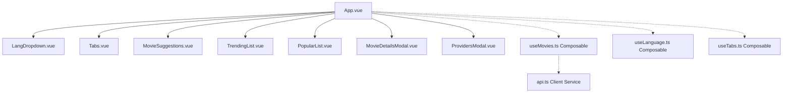
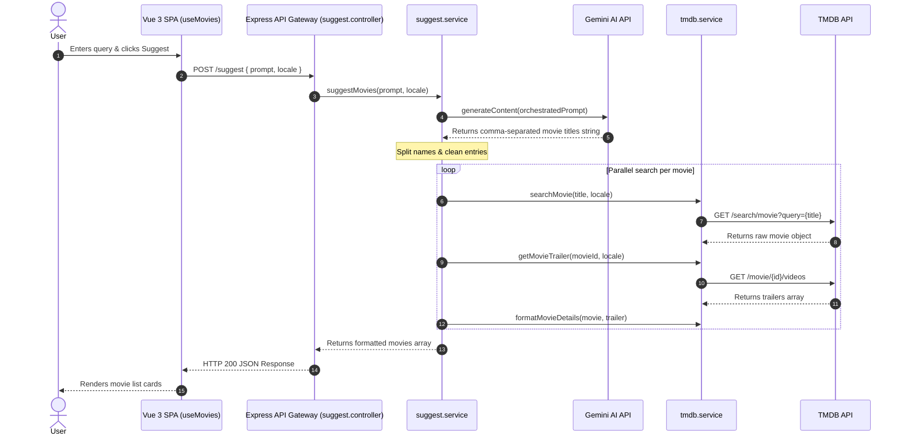
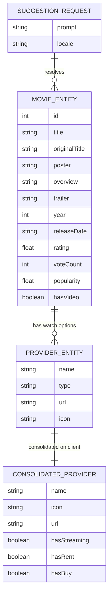
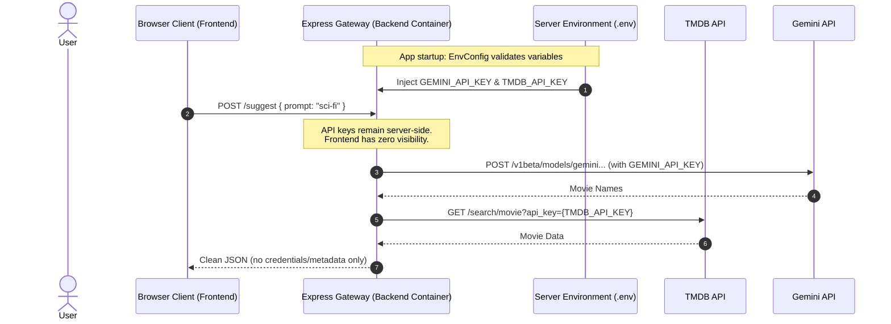

# Software Design Document — Cinematcha

**Document Version:** 1.0.0  
**Status:** APPROVED  
**Authored:** 2026-05-16  
**REQ Coverage:** REQ-001 ✅ | REQ-002 ✅ | REQ-003 ✅ | REQ-004 ✅ | REQ-005 ⏳

---

## Table of Contents

1. [System Overview](#1-system-overview)
2. [Business Context](#2-business-context)
3. [High-Level Architecture](#3-high-level-architecture)
4. [Frontend Architecture](#4-frontend-architecture)
5. [Backend Architecture](#5-backend-architecture)
6. [Integration Architecture](#6-integration-architecture)
7. [Database Architecture](#7-database-architecture)
8. [Deployment Architecture](#8-deployment-architecture)
9. [Security Model](#9-security-model)
10. [Scalability Model](#10-scalability-model)
11. [Technical Constraints](#11-technical-constraints)
12. [Risks and Trade-offs](#12-risks-and-trade-offs)

---

## 1. System Overview

Cinematcha is a production-grade, highly responsive fullstack web utility designed to solve decision paralysis in digital movie selection. The application acts as an intelligent, real-time middleware proxy, converting unstructured, natural language user prompts (e.g., "movies like Interstellar with mind-bending plots") into high-fidelity, structured recommendations complete with localized trailers, meta details, rating scores, and watch provider information (streaming, renting, and purchasing options).

The system is engineered as a decoupled client-server architecture consisting of:
- **Frontend SPA**: A Vue 3 application built with Vite, emphasizing lightweight components, reactive composable-based state management, multilingual support, and immediate micro-interactions.
- **Backend API Gateway**: A Node.js and Express server that acts as a secure reverse-proxy and orchestration layer. It manages authentication keys, transforms third-party data models, and aggregates responses from Google Gemini AI and The Movie Database (TMDB).

---

## 2. Business Context

Modern consumers struggle with digital content discovery due to fragmentation across dozens of subscription platforms (Netflix, Prime Video, Apple TV, Disney+, etc.) and the limitations of traditional genre-based search filters. Cinematcha directly addresses this market gap by:
1. **Natural Language Semantic Querying**: Removing rigid filter interfaces and allowing users to express complex moods, scenarios, or qualitative criteria (e.g., "movies for a rainy Sunday evening with family").
2. **Watch Provider Aggregation**: Resolving exactly where to watch suggestions within the user's localized market (e.g., Brazil or United States), thereby saving time and reducing friction.
3. **Cross-Border Support**: Catering to global markets through instant multilingual translation (Portuguese & English) for localized descriptions and region-specific streaming catalog entries.

---

## 3. High-Level Architecture

The architecture relies on a standard client-server pattern. The client never communicates directly with external resources, ensuring absolute security for sensitive credentials. The backend gateway manages internal pipeline coordination.

```mermaid
graph TD
    Client["Vue 3 SPA (Browser)"] -- "HTTPS / REST API" --> Backend["Node.js + Express API Gateway"]
    subgraph External APIs
        Backend -- "HTTPS / JSON SDK" --> Gemini["Google Gemini API (gemini-1.5-flash-latest)"]
        Backend -- "HTTPS / REST" --> TMDB["The Movie Database (TMDB) API"]
    end
    style Client fill:#41B883,stroke:#35495E,stroke-width:2px
    style Backend fill:#333333,stroke:#666666,stroke-width:2px
    style Gemini fill:#1A73E8,stroke:#1A5CBA,stroke-width:1px
    style TMDB fill:#01B4E4,stroke:#0177A4,stroke-width:1px
```



---

## 4. Frontend Architecture

The frontend is a lightweight Single Page Application (SPA) structured around the **Vue 3 Composition API** and the **Composable Pattern**. By organizing logic into composables, UI components remain mostly presentational, reactive, and reusable.

### Component Structure
- `App.vue`: Central layout coordinator. Renders global navigation tabs, language select widgets, search controls, and coordinates child views.
- `MovieSuggestions.vue`: Renders lists of recommendations returned from semantic AI prompt searches.
- `TrendingList.vue` / `PopularList.vue`: Standard list layouts rendering real-time TMDB trending and popular movie statistics.
- `MovieDetailsModal.vue`: Immersive modal displaying rich metadata, trailer players, and actions.
- `ProvidersModal.vue`: Modal displaying consolidated watch options.

### Composables (State Management)
- `useMovies.ts`: Holds reactive states (`movieSuggestions`, `trendingMovies`, `popularMovies`, `selectedMovie`, loading, and provider details) and interacts directly with the API Client Service.
- `useTabs.ts`: Controls global navigation switching and contextual active periods.
- `useLanguage.ts`: Manages translation triggers, current language state, and dropdown views.



---

## 5. Backend Architecture

The backend implements a highly scalable, domain-driven **Controller-Service** pattern, decoupling the HTTP parsing and routing layer from the underlying business rules and integration orchestrations.

### Architectural Breakdown
- **Route Manager (`server.js`)**: Configures core server frameworks, security headers, CORS settings, Express body parsers, and mounts module controllers.
- **Controller Layer (`suggest.controller.js`)**: Exposes public API endpoints (`POST /suggest`, `GET /suggest/tmdb/trending`, `GET /suggest/tmdb/popular`, `GET /suggest/tmdb/providers/:movieId`), parses inputs, validates payload boundaries, and calls service layers.
- **Service Layer (`suggest.service.js`)**: Handles core business orchestration, maps prompt locales, parses responses, and triggers parallel worker loops for data mapping.
- **External Integration (`tmdb.service.js`)**: Low-level client managing cache formatting, trailer checks, parameter assembly, and watch provider translations.

---

## 6. Integration Architecture

The integration layer details the exact message sequence of how Cinematcha processes natural language input, communicates with Google Gemini to extract entities, queries TMDB to fetch metadata, and builds the aggregated entity mapping.



---

## 7. Database Architecture

Cinematcha is intentionally designed as a **Stateless System** that does not maintain a local SQL, NoSQL, or local key-value store. This design minimizes operational costs, eliminates data privacy risks, and guarantees that recommendations always reflect live database records.

Despite being database-less, the system adheres to strict internal data contracts. The backend is responsible for receiving unstructured payloads, mapping external JSON configurations into predictable entity contracts, and delivering clean models to the Vue SPA client.



---

## 8. Deployment Architecture

The application is containerized using multi-container **Docker Compose** architectures. This encapsulates environment configurations, dependencies, network boundaries, and port mappings.

### Topology Key Points
- **Internal Network**: All containers communicate via a dedicated private bridge network (`app-network`).
- **DNS Resolution**: The frontend reaches the backend service utilizing the container's registered hostname: `http://backend:3001`.
- **Public Entrypoints**: The host machine maps port `5173` to the frontend container and port `3001` to the backend container.

```mermaid
graph TD
    subgraph Host Machine (Docker Engine)
        subgraph app-network (Bridge Network)
            Frontend[frontend container]
            Backend[backend container]
        end
    end
    
    UserBrowser([User Browser]) -- "Port 5173 (HTTP/SPA)" --> Frontend
    UserBrowser -- "Port 3001 (REST API)" --> Backend
    
    Backend -- "DNS: backend:3001" <-- Frontend
    Backend -- "Outbound HTTPS (443)" --> GeminiAPI["Google Gemini API"]
    Backend -- "Outbound HTTPS (443)" --> TMDBAPI["TMDB API"]

    subgraph Volumes & Configs
        BackendEnv["backend/.env"] -.-> Backend
        FrontendEnv["frontend/.env"] -.-> Frontend
    end
```

---

## 9. Security Model

Cinematcha enforces robust API security and credential isolation. No third-party API keys or sensitive authorization metrics are ever transmitted to or stored within the client browser.

### Security Gates & Key Flows
1. **Secret Isolation**: All sensitive keys reside securely on the host server inside containerized `.env` configurations.
2. **Startup Environment Guard**: The backend `EnvConfig` validates environment properties during initialization and throws a fatal boot error if variables are missing.
3. **Encapsulated Inbound Traffic**: Cross-Origin Resource Sharing (CORS) configurations restrict browser request headers to authorized interfaces.



---

## 10. Scalability Model

### Horizontal Pod Autoscaling
Because the Node.js API Gateway is completely stateless, the container can scale horizontally (via Kubernetes replicas or an AWS ECS Service Auto Scaling Group) behind a standard Application Load Balancer (ALB).

### Bottlenecks and Rate Limits
The primary operational scaling constraint is rate limiting on upstream provider APIs:
- **Google Gemini API**: Subject to Request-Per-Minute (RPM) and Token-Per-Minute (TPM) limits depending on tier.
- **TMDB API**: Subject to IP-based rate limiting or global key constraints under peak loads.

---

## 11. Technical Constraints

1. **Third-Party Availability**: Application availability is 100% dependent on Gemini AI and TMDB API health.
2. **Network I/O Latency**: Because the service performs real-time queries rather than loading from a local index, latency is highly sensitive to the geographic region of the hosting environment and response latency of the upstream APIs.
3. **Browser Execution Limits**: In single-page applications, all state histories reside in the browser’s volatile RAM. Tab closures erase current search results.

---

## 12. Risks and Trade-offs

| Risk Identified | Potential Impact | Mitigating Strategy / Trade-off |
| :--- | :--- | :--- |
| **Missing Cache Layer** | High resource consumption; slower response times for repetitive queries; fast rate-limit exhaustion. | **Trade-off**: Simpler architecture with zero storage footprint. **Mitigation**: Future expansion should mount a lightweight Redis cache layer inside `docker-compose.yml`. |
| **Upstream API Failure** | Total application outage on the search tab. | **Mitigation**: Implemented robust global try/catch error middleware. Friendly fallback messages notify users of temporary network shortages without exposing system traces. |
| **Serial Request Latency** | Loops mapping individual movies to get trailers sequentially can inflate total response times. | **Mitigation**: Used `Promise.all` inside `suggest.service.js` to execute sub-queries in parallel, minimizing network execution bottlenecks. |
